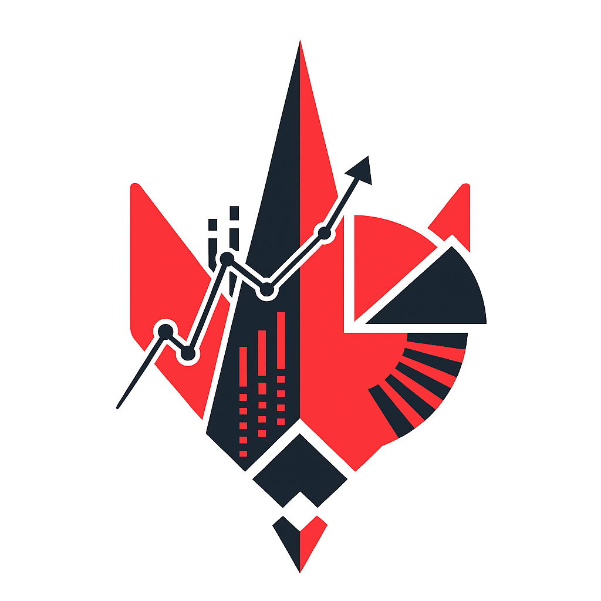

<div align="center">
  
  <h1>SpikePlanted</h1>
  <p><em>Uma solução completa para análise de dados do cenário competitivo de Valorant, com uma API própria alimentada por web scraping e dashboards interativos na web (React) e no Power BI.</em></p>
  <br>
  
</div>

---

## 📋 Sumário

- [📖 Sobre o Projeto](#-sobre-o-projeto)
- [🛠️ Tech Stack](#%EF%B8%8F-tech-stack)
- [📂 Estrutura do Projeto](#-estrutura-do-projeto)
- [👨‍💻 Autores](#-autores)
- [🤝 Quer contribuir?](#-quer-contribuir)

---

## 📖 Sobre o Projeto

O **SpikePlanted** é um ecossistema completo de análise de dados, desenvolvido para criar uma nova maneira de fãs e analistas consumirem informações do cenário competitivo de Valorant. 

O projeto é estruturado em **três componentes principais** que trabalham em conjunto: 
1. **API de Dados (Backend):** O coração do projeto é uma API customizada, construída em **Python** e utilizando técnicas de **Web Scraping** para extrair dados diretamente do portal [vlr.gg](https://www.vlr.gg/), funcionando como uma fonte de dados centralizada e confiável.
2. **Dashboard Web (Frontend):** Para garantir uma experiência de usuário atraente e intuitiva, foi desenvolvido um dashboard web moderno com **React** que consome os dados da nossa API Python e apresenta as informações de forma visual, amigável e fácil de navegar, ideal para consultas rápidas sobre partidas, jogadores e estatísticas.
3. **Painel de Análise (Power BI):** Visando análises de dados mais profundas e a geração de relatórios gerenciais, foi criado um dashboard no **Power BI** que se conecta diretamente à mesma API Python e permite o cruzamento de dados, a identificação de tendências e a criação de insights complexos que vão além da visualização padrão.

---

## 🛠️ Tech Stack

As seguintes ferramentas e tecnologias foram utilizadas na construção do **SpikePlanted**:

#### Frontend
<p align="center">
  
  
  
  
  
  
  
  
</p>

#### Backend
<p align="center">
  
  
  
    
</p>

#### Ferramentas & Design
<p align="center">
  
  
  
  
  
</p>

---

## 📂 Estrutura do Projeto

O projeto é organizado em uma arquitetura full-stack que será atualizada conforme o desenvolvimento, contendo duas pastas no momento: 

```
spikeplanted/               
│
|
├── 📁 docs/ (Documentação)
├── 📁 IMGs/ (Imagens e Assets Visuais)   
```
---

## 👨‍💻 Autores

<table>
  <tr>
    <td align="center">
      <a href="https://github.com/AndreyRodr">
        <br>
        <sub>
          <b>Andrey Rodrigues</b>
        </sub>
      </a>
    </td>
    <td align="center">
      <a href="https://github.com/jptrava">
        <br>
        <sub>
          <b>João Pedro</b>
        </sub>
      </a>
    </td>
    <td align="center">
      <a href="https://github.com/LucassTeixeiraN">
        <br>
        <sub>
          <b>Lucas Teixeira</b>
        </sub>
      </a>
    </td>
    <td align="center">
      <a href="https://github.com/DeVinc1">
        <br>
        <sub>
          <b>Marcos Vinícius</b>
        </sub>
      </a>
    </td>
  </tr>
</table>

---
## 🤝 Quer Contribuir?

Que ótimo! Contribuições são a alma deste projeto. Se você tem uma ideia legal, encontrou um bug ou quer adicionar um recurso, veja como é fácil participar:

### 💡  Abra uma Issue!
Para garantir que seu esforço esteja alinhado com o projeto, **abra uma Issue primeiro**. Lá podemos discutir sua ideia, refinar os detalhes e evitar trabalho duplicado.

### 🚀 O Fluxo de Contribuição

1.  **Faça o Fork:** Crie uma cópia sua do projeto clicando em "Fork".

2.  **Clone:** Baixe o seu fork para a sua máquina.
    ```bash
    git clone https://github.com/seu-usuario/nome-do-repositorio-forkado.git
    ```

3.  **Crie uma Branch:** Sempre trabalhe em uma branch separada!
    ```bash
    git checkout -b feature/minha-ideia-incrivel
    ```

4.  **Codifique:** Faça sua mágica acontecer! Adicione seu recurso ou corrija aquele bug.

5.  **Faça o Commit:** Use mensagens de commit claras e seguindo o padrão *Conventional Commits*.
    ```bash
    # Exemplo:
    git commit -m 'feat: Adiciona gráfico de win rate por agente'
    ```

6.  **Faça o Push:** Envie seu trabalho para o seu fork no GitHub.
    ```bash
    git push origin feature/minha-ideia-incrivel
    ```
7.  **Abra um Pull Request:** Vá até o repositório original e abra um PR. Descreva bem o que você fez para facilitar a revisão.

Depois disso, é só aguardar o feedback. Agradecemos imensamente por dedicar seu tempo a este projeto. Juntos, vamos decifrar o cenário competitivo de Valorant! 💥
